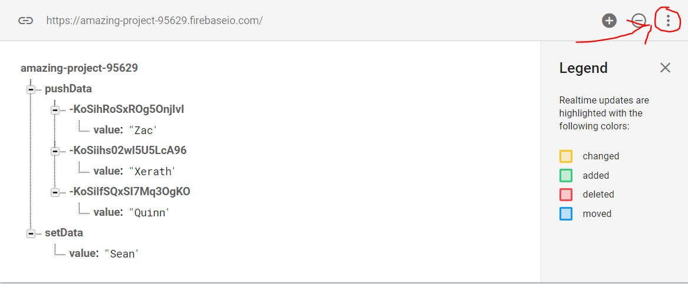
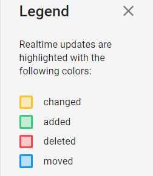
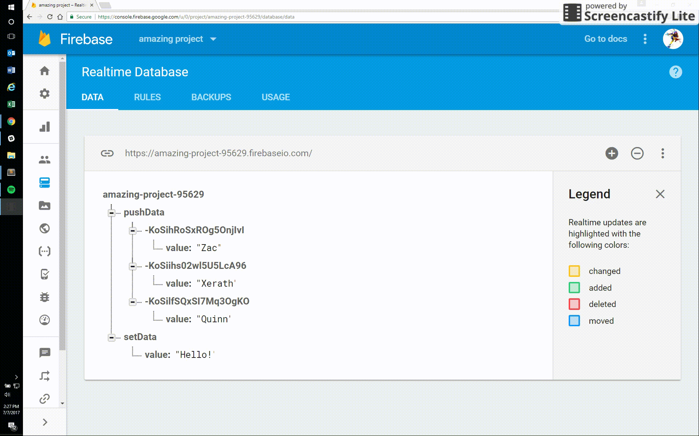
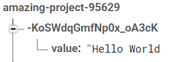

# Get Started With Firebase in 5-10 Minutes

**Table of Contents**

- [What is Firebase?](#what-is-firebase)
- [Adding Firebase to your website](#adding-firebase-to-your-website)
- [Setting up Realtime Database](#setting-up-realtime-database)
- [Pulling data from the Realtime Database](#pulling-data-from-the-realtime-database)
- [Updating data in the Realtime Database](#updating-data-in-the-realtime-database)
- [Dealing with Firebase Generated Unique Ids](#dealing-with-firebase-generated-unique-ids)
- [Conclusion](#conclusion)

The goal of this article is to expose you to the basics of Firebase and provide simple, working examples. If you want to go more in depth, check out Firebase's [documentation](https://firebase.google.com/docs/reference/js/firebase.database)

----

### What is Firebase?
Firebase is a platform that allows you to build websites without server side code. It has a ton of cool features but we are going to be focused on it's Realtime database.

Now lets get started.

---

### Adding Firebase to your website.

- Step 1: Go to console.firebase.google.com
- Step 2: Add a project
- Step 3: Press "Add Firebase to your web app"
- Step 4: Copy that code into your HTML page

### Setting up the Realtime Database

- Step 1: Go into your Database
- Step 2: Click the rules tab
- Step 3: Change your rules to the code snippet below. Normally you shouldn't do this due to security reasons, but for testing purposes it will be fine. Read more about it [here](https://firebase.google.com/docs/database/security/securing-data)
```javascript
{
  "rules": {
    ".read": "true",
    ".write": "true"
  }
}
```
- Step 4: Download the demo.json from [here](https://raw.githubusercontent.com/JSneak/jsneak.github.io/master/blog/firebase-tutorial/demo.json). Right click and Save as on the page to download it. Don't forget to name is **demo.json**, not **demo.json.txt**.
- Step 5: Import demo.json to firebase



### Pulling data from the Realtime Database

First add the following code to your script tag.
```javascript
var database = firebase.database();
```
There are two main ways to get data from the database, but for now we are going to focus on **.once**. Use this if you want to pull from the database just one time. 
```javascript
database.ref('/').once('value', function(snapshot){
  console.log(snapshot.val());
});
```
The database will listen at the root directory, which is done with **.ref('/')**. Below is another way to declare the **.ref**.
```javascript
var rootRef = database.ref('/');
rootRef.once('value', function(snapshot){
    console.log(snapshot.val());
});
```
When you make a call to the Firebase Database, it will return a **snapshot**, which is data at the reference point you gave it. To access this data, we use **.val()**.

Now, lets say that our data was in a different child location, as it is in the image below.


Getting that data is still easy. Instead of **database.ref('/')**, we would do **database.ref('/username')** to get the data.

Now, what if you want to continue to listen for updates past the first one? In that case, you would use **.on()**

What **.on()** does is that it will listen for a certain event at a specific child. The different types of events are shown below.



We are going to be focusing on 2 of the events, **child_added** and **child_changed** events. 

#### child_added event

This will run when the user loads the page, and can be used in place of a **.once()**. This will return the values that are pushed/set.

```javascript
pushDataRef = database.ref("/pushData");
pushDataRef.on("child_added", function(snapshot){
  console.log("Below is the data from child_added");
  console.log(snapshot.val());
});
```

#### child_changed event

This will return the values that are changed.

```javascript
setDataRef = database.ref("/setData");
setDataRef.on('child_changed', function(snapshot) {
  console.log("Below is the data from child_changed");
  console.log(snapshot.val());
});
```

If you aren't sure if you are updating or adding, then just have the Firebase Database on your screen as it will flash different colors based on what action is going on.



### Updating data in the Realtime Database

Lets add a button and text box on our page for this example.
```html
<button onClick="pushData()">Add data to Firebase</button>
<input type="value" id="dataValue"></input>
```
The two ways I update/create values in the database is with **.push()** and **.set()**.

You use **.push()** if you want to create a new child location with a new generated id. You can then use **.set()** to update a key:value pair.

Below is an example of using **.push()** and **.set()**
```javascript
function pushData(){
  var data = document.getElementById("dataValue").value;
  var dataRef = database.ref('/').push();//Generates a new child location with a randomly generated id.
  dataRef.set({
    value: data
  });
}
```
Another example, except this time it is only using **.set**.
```javascript
function setData(){
  var data = document.getElementById("dataValue").value;
  var dataRef = database.ref('/newData');
  console.log(data)
  dataRef.set({
    value: data
  });
}
```
If you want to make a new parent and child without having to use **.push()**, you would do this if you don't want to use a firebase generated UID, then do the example below.
```javascript
function setData(){
  var data = document.getElementById("dataValue").value;
  var dataRef = database.ref('/newData/' + "nameOfNewParent");
  console.log(data)
  dataRef.set({
    value: data
  });
}
```

### Dealing with Firebase Generated Unique Ids
Now, you might have noticed that Firebase creates a crazy string of characters and numbers when you use **.push()**.



This is the UID, unique ID, that Firebase generates when we use **.push()**. We can get the UID of a child by using either **Object.keys()** or **.key()** as demonstrated below.

#### Object.keys()
This will return an array of keys.
```javascript
database.ref('/pushData').once('value', function(snapshot){
  console.log(Object.keys(snapshot.val()));
})
```
#### .key
This will return the key of 1 object.
```javascript
database.ref('/pushData').once('value', function(snapshot){
  snapshot.forEach(function(data){
    console.log(data.key);
  });
})
```

### Conclusion

Hope this helps with getting you started with Firebase. If you have any issues or questions, create an issue [here](https://github.com/JSneak/jsneak.github.io/issues).